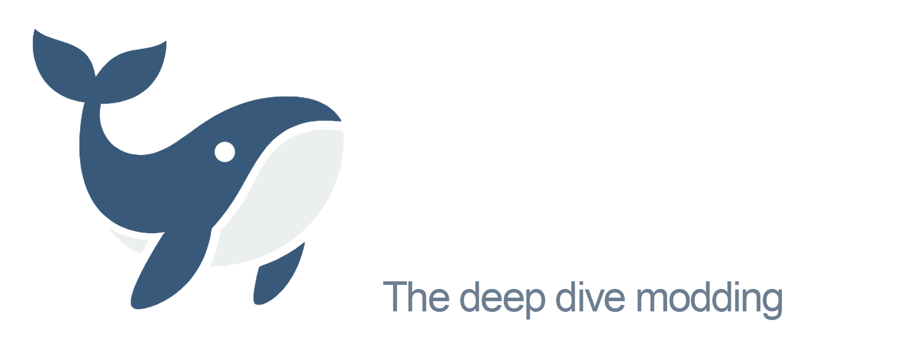
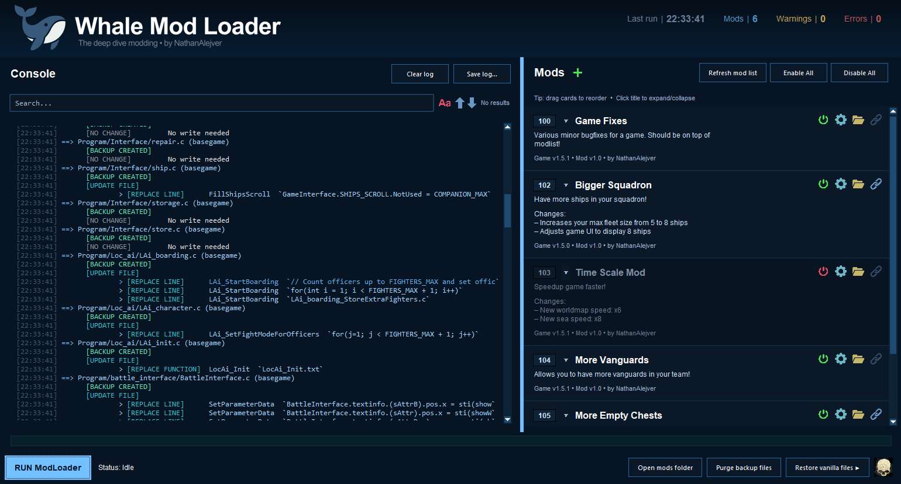

# Whale Mod Loader 
Whale Mod Loader is a simple, open-source tool for Caribbean Legend that helps you create, install, and manage mods easily **without worrying about incompatibility!** The idea is to stop relying on file replacements and instead edit the requested file… surgically. 🐟 It means:

- Replace individual line(s) of code in function(s)
- Replace entire functions
- Inject code at the beginning/end of the file

…That’s the **deep dive modding!**

WML works by **patching files** while keeping the original ones as a backup. It shows you what has been changed and where (including Workshop items aswell). As an example, my 1.5.1 mod combination patch has changed 151 lines, 17 functions and 1 file, while keeping full compatibility with Perks Reworked, Persona, QPL, Tor and WDC. Just one click and viola! 💙

# Installation and Usage

⚠️ *Before installation, make sure to **VERIFY YOUR STEAM FILES!** You need to have clear game installation (Vanilla + Workshop Mods)* ⚠️ 

1. Download [the latest release](https://github.com/NathanAlejver/whalemodloader/releases/)
1. Unpack and place "WhaleModLoader" folder directly **into game room directory.** *(steamapps/common/Caribbean Legend/)*
2. Launch .exe and click "RUN Modloader", as the first run creates vanilla backup files.
3. Subscribe any **[ModLoader]** workshop item and refresh WML *(F5 or "Refresh mod list" button).*
4. RUN again to patch.

📌 If you want to quickly check how it works, you can subscribe my simple mod: ["More Empty Chests"](https://steamcommunity.com/sharedfiles/filedetails/?id=3535794729). If you can buy, well, more empty chests in a bank, it means WML works! 
📌 Each time you install or remove a mod, **you should RUN ModLoader to update your game files. **You should do it aswell if game version changes.

## About me
Game dev, 3D artist and horror writer. I love exploring Beauty hidden in darkest shadows. I believe art should serve people, not art itself nor artist’s ego – because it’s all about making us a better person. I hope this little mod loader, while not being art, will help you get even more out of **Caribbean Legend.**

Contact: [Discord Server](https://discord.gg/GnsUpqNDv7)

Check out my other projects:
- [Artstation](https://nathanalejver.artstation.com/)
- [Instagram](https://www.instagram.com/campionearts/)
- [And my upcoming horror game!](https://www.facebook.com/Archeognosis/) 
